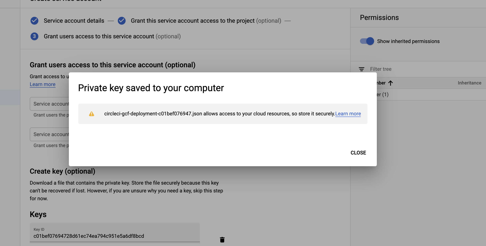

# Deploy to Google Cloud Functions with CircleCI - An Example
This repository contains example code and instructions for setting up a project to deploy to Google Cloud Functions via CircleCI.

## Setup

## Create A Service Account and Keys
To set up automated deployment with CircleCI, we first need to create a service account. This is basically a public/private keypair that will allow CircleCI to login and perform actions on your Google Cloud project; in this case, we're restricting the actions to Cloud Functions.

First, login to your console at [console.cloud.google.com](console.cloud.google.com) and visit the Service Accounts section under IAM & admin in the sidebar.


Next, click the "Create Service Account" button at the top of the console to create a new service account for CircleCI.


You'll be taken to the serevice account wizard. Give the account a name (it's based off email, so something like `circleci-gcf-deployer` will work just fine). The account ID will be chosen automatically. Also write a description so you know what this account does when you review it a few months from now.

Once that's done, click the "Create" button.


Next, we assign the account the "Cloud Functions Developer" role, which will allow it to write to cloud-functions resources (deploy).

Once selected, click the Done button at the bottom of the screen to move to the next step.


Next, we need to generate a public/private key pair to let CircleCI access the account. Click the create key button to bring up the key dialog.


Use the default selection of JSON, and click the create button. The private key will be downloaded to your local computer - do not share it; anyone who has access can perform those scopes that you selected in the previous screen (read/write cloud functions).


Make note of the name of the key file, and where it was saved on your machine - we will come back to it in just a moment.



Close the dialog and click the Done button to complete the process.


If all went successfully you should see a screen looking something like this. You've successfully created a service account and an associated key - congrats!


## Create the CircleCI Project and Add Environment Variables

Now that we've got our private key, we need to create a CircleCI project. We're going to assume this project is already on GitHub in the same format that it exists now (with a `src` directory and a `.circleci` directory).

Our next steps are to navigate to CircleCI and set up the project.


## Set Environment Variables
Remember that service_key.json file we downloaded? We now need to store it as a project environment variable in CircleCI so it can be injected into the container when it's time to deploy.

Since however Circle can be a little picky about the characters it allows in the UI, we will first base64 encode it.

```bash
cat the_service_account_file.json | base64
```

Running this command (using the correct name of your file), will output a long base64 string. Copy the entire thing, and paste it into the value box CircleCI project settings environment variable screen with `GCLOUD_SERVICE_KEY` as the key.

We can finally make a test commit to master to ensure our build is working properly.


## Deployment
With our current CircleCI configuration, any time a change (or merge) is made to master, a new version of our cloud function will be deployed automatically.
